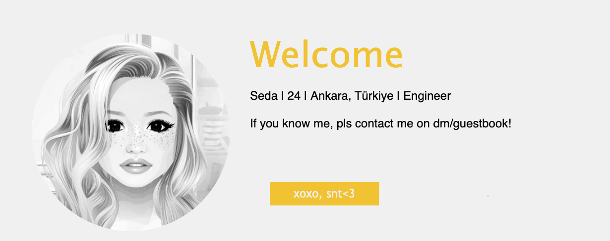

# Stardoll | About Me Code Sample

    This is a code sample for the Stardoll "About Me" section. Cloned from <a href="https://presentatiecharly.blogspot.com/2020/08/presentation-1957.html#more">HERE</a>!

## Output

## Usage

- Copy the code from `aboutme.md` and paste it into your Stardoll "About Me" section.
- Save
- You will see an error message, but don't worry, it will still work.
- You can edit the text in the code to customize it to your liking.
- You can also change the image link to your own image link.

    <i>
        <b>
    made with 🤍 by snt
        </b>
    </i>

